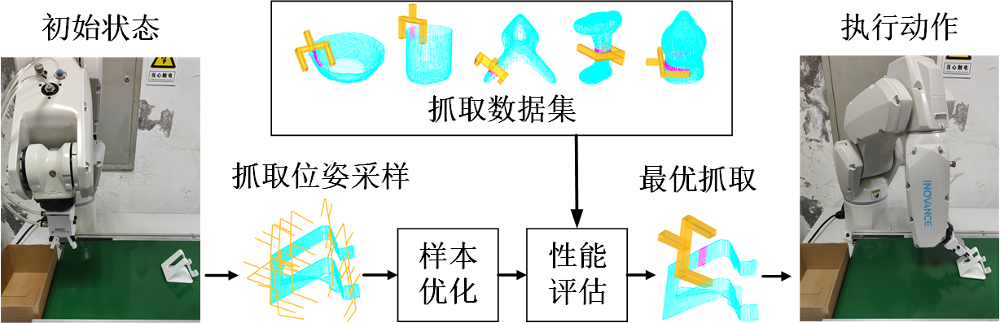
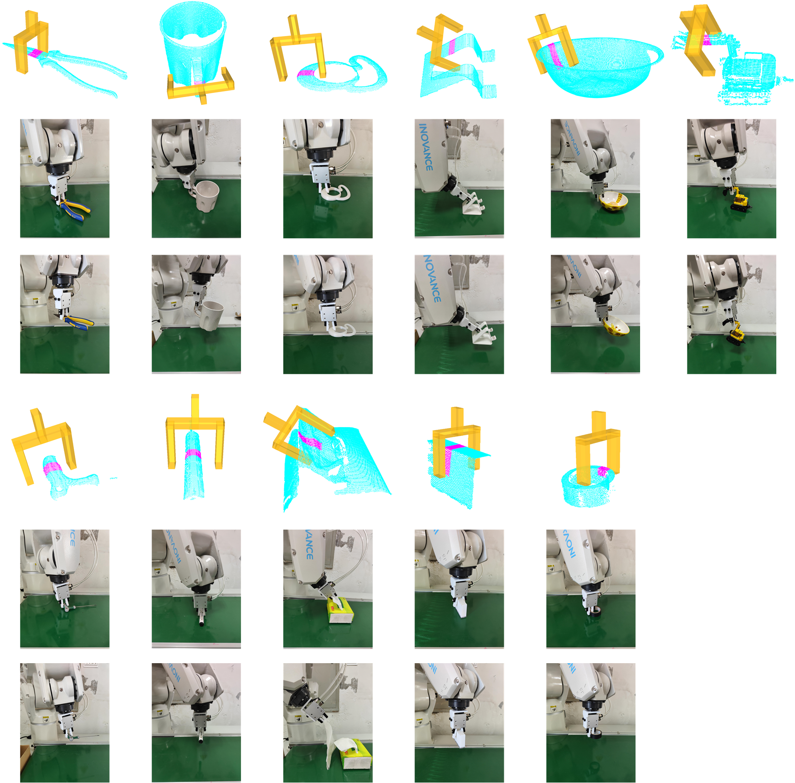
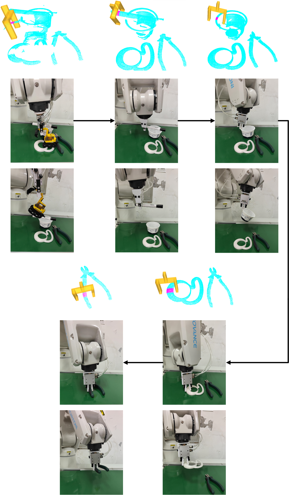

# 6-DOF-ConvGPD

## 基于未知物体三维点云特征的机器人六自由度抓取
（自己论文查重竟然查到了自己投稿简介，( ╯□╰ )，暂时先删了，后面补上）

## 示意图
* 方法流程

* 单物体抓取实验结果

* 多物体抓取实验结果

## 视频

## 依赖
- PCL 1.8 或以上
- Libtorch(与安装的Pytorch版本保持一致)

## 致谢
- [gpg](https://github.com/atenpas/gpg)
- [gpd](https://github.com/atenpas/gpd)
- [PointNetGPD](https://github.com/lianghongzhuo/PointNetGPD)
- [6dof-graspne](https://github.com/NVlabs/6dof-graspnet)
- [convPoint](https://github.com/aboulch/ConvPoint)
- [pointnet](https://github.com/fxia22/pointnet.pytorch)
